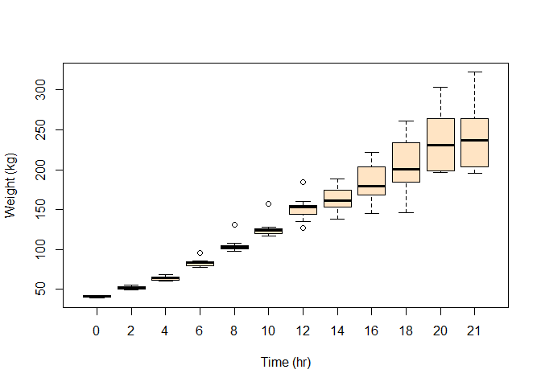

ChickenWeight
================
Donald
2024-03-10

## R Markdown

This is an R Markdown document. Markdown is a simple formatting syntax
for authoring HTML, PDF, and MS Word documents. For more details on
using R Markdown see <http://rmarkdown.rstudio.com>.

When you click the **Knit** button a document will be generated that
includes both content as well as the output of any embedded R code
chunks within the document. You can embed an R code chunk like this:

# Load Data

``` r
data("ChickWeight")

chickWeight = ChickWeight

head(chickWeight, 8)
```

    ##   weight Time Chick Diet
    ## 1     42    0     1    1
    ## 2     51    2     1    1
    ## 3     59    4     1    1
    ## 4     64    6     1    1
    ## 5     76    8     1    1
    ## 6     93   10     1    1
    ## 7    106   12     1    1
    ## 8    125   14     1    1

# Subset of data that meet the condition Chick is equal four.

``` r
sub1 = subset(chickWeight, chickWeight$Chick == 4)
head(sub1, 8)
```

    ##    weight Time Chick Diet
    ## 37     42    0     4    1
    ## 38     49    2     4    1
    ## 39     56    4     4    1
    ## 40     67    6     4    1
    ## 41     74    8     4    1
    ## 42     87   10     4    1
    ## 43    102   12     4    1
    ## 44    108   14     4    1

``` r
plot(sub1$weight ~ sub1$Time, data = sub1, col=palette(), pch=15, ylab = "Weight (kg)", xlab = "Time (hr)")
```

<!-- -->

``` r
plot(sub1$weight ~ sub1$Time, data = sub1, type = 'l', col="blue", ylab = "Weight (kg)", xlab = "Time (hr)")
```

<!-- -->

``` r
boxplot(weight ~ Time, data = sub1,  col = "bisque", ylab = "Weight (kg)", xlab = "Time (hr)")

points(sub1$weight ~ sub1$Time, data = sub1, type = 'b', col="red", ylab = "Weight (kg)", xlab = "Time (hr)")
```

<!-- --> \#
Subset of data that meet the condition Diet is equal four.

``` r
head(chickWeight, 8)
```

    ##   weight Time Chick Diet
    ## 1     42    0     1    1
    ## 2     51    2     1    1
    ## 3     59    4     1    1
    ## 4     64    6     1    1
    ## 5     76    8     1    1
    ## 6     93   10     1    1
    ## 7    106   12     1    1
    ## 8    125   14     1    1

``` r
sub2 = subset(chickWeight, chickWeight$Diet == 4)
head(sub2, 8)
```

    ##     weight Time Chick Diet
    ## 461     42    0    41    4
    ## 462     51    2    41    4
    ## 463     66    4    41    4
    ## 464     85    6    41    4
    ## 465    103    8    41    4
    ## 466    124   10    41    4
    ## 467    155   12    41    4
    ## 468    153   14    41    4

``` r
boxplot(weight ~ Time, data = sub2,  col = "bisque", ylab = "Weight (kg)", xlab = "Time (hr)")
```

<!-- --> \#
Compute the mean

``` r
subAg = aggregate(weight ~ Time, sub2, mean)

head(subAg, 8)
```

    ##   Time weight
    ## 1    0   41.0
    ## 2    2   51.8
    ## 3    4   64.5
    ## 4    6   83.9
    ## 5    8  105.6
    ## 6   10  126.0
    ## 7   12  151.4
    ## 8   14  161.8

# Subset of data that meet the condition Diet is equal two.

``` r
sub3 = subset(chickWeight, chickWeight$Diet == 2)

head(sub3, 8)
```

    ##     weight Time Chick Diet
    ## 221     40    0    21    2
    ## 222     50    2    21    2
    ## 223     62    4    21    2
    ## 224     86    6    21    2
    ## 225    125    8    21    2
    ## 226    163   10    21    2
    ## 227    217   12    21    2
    ## 228    240   14    21    2

``` r
subAg1 = aggregate(weight ~ Time, sub3, mean)

head(subAg1, 8)
```

    ##   Time weight
    ## 1    0   40.7
    ## 2    2   49.4
    ## 3    4   59.8
    ## 4    6   75.4
    ## 5    8   91.7
    ## 6   10  108.5
    ## 7   12  131.3
    ## 8   14  141.9

``` r
plot(subAg$weight ~ subAg$Time, data = subAg, type = 'b', col="red",pch=15, ylab = "Weight (kg)", xlab = "Time (hr)")

points(subAg1$weight ~ subAg1$Time, data = subAg1, type = 'b', col="purple",pch=19, ylab = "Weight (kg)", xlab = "Time (hr)")
```

<!-- -->
