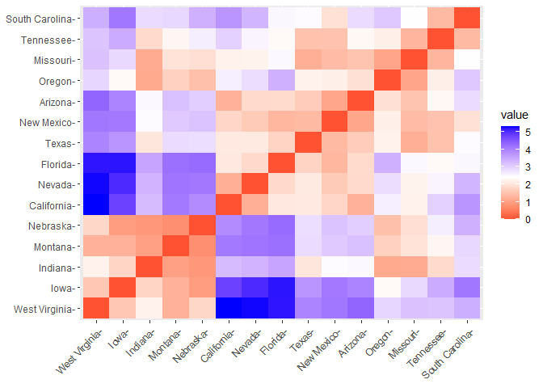

In-Built Dataset Analysis
================
Donald
2024-03-10

## R Markdown

This is an R Markdown document. Markdown is a simple formatting syntax
for authoring HTML, PDF, and MS Word documents. For more details on
using R Markdown see <http://rmarkdown.rstudio.com>.

When you click the **Knit** button a document will be generated that
includes both content as well as the output of any embedded R code
chunks within the document. You can embed an R code chunk like this:

# Check the dataset package directory

``` r
ls('package:datasets')
```

    ##   [1] "ability.cov"           "airmiles"              "AirPassengers"        
    ##   [4] "airquality"            "anscombe"              "attenu"               
    ##   [7] "attitude"              "austres"               "beaver1"              
    ##  [10] "beaver2"               "BJsales"               "BJsales.lead"         
    ##  [13] "BOD"                   "cars"                  "ChickWeight"          
    ##  [16] "chickwts"              "co2"                   "CO2"                  
    ##  [19] "crimtab"               "discoveries"           "DNase"                
    ##  [22] "esoph"                 "euro"                  "euro.cross"           
    ##  [25] "eurodist"              "EuStockMarkets"        "faithful"             
    ##  [28] "fdeaths"               "Formaldehyde"          "freeny"               
    ##  [31] "freeny.x"              "freeny.y"              "HairEyeColor"         
    ##  [34] "Harman23.cor"          "Harman74.cor"          "Indometh"             
    ##  [37] "infert"                "InsectSprays"          "iris"                 
    ##  [40] "iris3"                 "islands"               "JohnsonJohnson"       
    ##  [43] "LakeHuron"             "ldeaths"               "lh"                   
    ##  [46] "LifeCycleSavings"      "Loblolly"              "longley"              
    ##  [49] "lynx"                  "mdeaths"               "morley"               
    ##  [52] "mtcars"                "nhtemp"                "Nile"                 
    ##  [55] "nottem"                "npk"                   "occupationalStatus"   
    ##  [58] "Orange"                "OrchardSprays"         "PlantGrowth"          
    ##  [61] "precip"                "presidents"            "pressure"             
    ##  [64] "Puromycin"             "quakes"                "randu"                
    ##  [67] "rivers"                "rock"                  "Seatbelts"            
    ##  [70] "sleep"                 "stack.loss"            "stack.x"              
    ##  [73] "stackloss"             "state.abb"             "state.area"           
    ##  [76] "state.center"          "state.division"        "state.name"           
    ##  [79] "state.region"          "state.x77"             "sunspot.month"        
    ##  [82] "sunspot.year"          "sunspots"              "swiss"                
    ##  [85] "Theoph"                "Titanic"               "ToothGrowth"          
    ##  [88] "treering"              "trees"                 "UCBAdmissions"        
    ##  [91] "UKDriverDeaths"        "UKgas"                 "USAccDeaths"          
    ##  [94] "USArrests"             "UScitiesD"             "USJudgeRatings"       
    ##  [97] "USPersonalExpenditure" "uspop"                 "VADeaths"             
    ## [100] "volcano"               "warpbreaks"            "women"                
    ## [103] "WorldPhones"           "WWWusage"

# Use one of the in-built datasets

``` r
data("USArrests")

df = USArrests
df = na.omit(df)

head(df, 5)
```

    ##            Murder Assault UrbanPop Rape
    ## Alabama      13.2     236       58 21.2
    ## Alaska       10.0     263       48 44.5
    ## Arizona       8.1     294       80 31.0
    ## Arkansas      8.8     190       50 19.5
    ## California    9.0     276       91 40.6

# Standardize the dataset

``` r
df1 = scale(USArrests)
head(df1, 5)
```

    ##                Murder   Assault   UrbanPop         Rape
    ## Alabama    1.24256408 0.7828393 -0.5209066 -0.003416473
    ## Alaska     0.50786248 1.1068225 -1.2117642  2.484202941
    ## Arizona    0.07163341 1.4788032  0.9989801  1.042878388
    ## Arkansas   0.23234938 0.2308680 -1.0735927 -0.184916602
    ## California 0.27826823 1.2628144  1.7589234  2.067820292

``` r
set.seed(123) #Setting a seed ensures that the random numbers generated by R are reproducible
ss = sample(1:50, 15)
df1 = USArrests[ss,]
df1.scaled = scale(df1)
df1.scaled
```

    ##                     Murder     Assault    UrbanPop        Rape
    ## New Mexico      0.58508090  1.02300309  0.22505574  0.61101857
    ## Iowa           -1.70220419 -1.54760088 -0.68923319 -1.43885018
    ## Indiana        -0.45911447 -0.90775622 -0.12659385 -0.48290177
    ## Arizona        -0.23535832  1.12403120  0.92835492  0.50261205
    ## Tennessee       1.03259320 -0.06585536 -0.54857336  0.09855138
    ## Texas           0.90828422  0.08007413  0.92835492 -0.03942055
    ## Oregon         -1.03093574 -0.39139036  0.01406598  0.33507470
    ## West Virginia  -0.83204139 -1.26696726 -1.95517172 -1.63595295
    ## Missouri       -0.01160217 -0.17810880  0.22505574  0.22666818
    ## Montana        -0.75745600 -0.95265760 -0.97055287 -0.93623813
    ## Nebraska       -1.18010651 -1.03123501 -0.33758361 -0.92638299
    ## California     -0.01160217  0.92197499  1.70198401  1.44870532
    ## South Carolina  1.33093473  0.95565102 -1.32220246 -0.33507470
    ## Nevada          0.78397525  0.65256671  0.99868483  1.98088278
    ## Florida         1.57955267  1.58427034  0.92835492  0.59130829
    ## attr(,"scaled:center")
    ##     Murder    Assault   UrbanPop       Rape 
    ##   9.046667 193.866667  66.800000  25.900000 
    ## attr(,"scaled:scale")
    ##    Murder   Assault  UrbanPop      Rape 
    ##  4.022236 89.084123 14.218700 10.146991

# Euclidean Distance Matrix section

``` r
library("factoextra")
```

    ## Warning: package 'factoextra' was built under R version 4.3.3

    ## Loading required package: ggplot2

    ## Warning: package 'ggplot2' was built under R version 4.3.3

    ## Welcome! Want to learn more? See two factoextra-related books at https://goo.gl/ve3WBa

``` r
dist.eucl = dist(df1.scaled, method = "euclidean")

dist.eucl
```

    ##                New Mexico      Iowa   Indiana   Arizona Tennessee     Texas
    ## Iowa            4.1082312                                                  
    ## Indiana         2.4775986 1.7846775                                        
    ## Arizona         1.0907378 3.9591819 2.5024750                              
    ## Tennessee       1.4990012 3.4724739 1.8574561 2.3169189                    
    ## Texas           1.3824891 3.7468614 2.0384260 1.6405987 1.4956943          
    ## Oregon          2.1754724 2.3299921 1.1324681 1.9476753 2.1763803 2.2268866
    ## West Virginia   4.1297061 1.5739722 2.2229105 4.3544334 3.1474682 3.9631926
    ## Missouri        1.3951436 2.8885151 1.1661044 1.5219757 1.3106718 1.2158464
    ## Montana         3.0869279 1.2562907 1.0043926 3.2033362 2.2890064 2.8725177
    ## Nebraska        3.1647982 0.9620290 0.8810612 3.0302391 2.6311604 2.8258957
    ## California      1.8025742 4.7971697 3.2592923 1.2587645 2.9923364 2.0899781
    ## South Carolina  1.9621250 4.1334214 2.8509464 2.8719947 1.3852857 2.4693498
    ## Nevada          1.6284385 5.0562305 3.3639807 1.8578349 2.5524734 2.1047024
    ## Florida         1.3412730 5.2265362 3.5543219 1.8744570 2.3337108 1.7638102
    ##                   Oregon West Virginia  Missouri   Montana  Nebraska California
    ## Iowa                                                                           
    ## Indiana                                                                        
    ## Arizona                                                                        
    ## Tennessee                                                                      
    ## Texas                                                                          
    ## Oregon                                                                         
    ## West Virginia  2.9272924                                                       
    ## Missouri       1.0680817     3.1751350                                         
    ## Montana        1.7249703     1.2503714 1.9844533                               
    ## Nebraska       1.4651232     1.8157092 1.9337313 0.7652157                     
    ## California     2.6178636     5.3248937 2.2101756 4.1110770 3.8705700           
    ## South Carolina 3.1028481     3.4221970 2.4077748 2.9134297 3.4017884  3.7591374
    ## Nevada         2.8393497     5.3012159 2.2357853 4.1641622 4.1146826  1.2179355
    ## Florida        3.4087336     5.2173518 2.5030673 4.2233709 4.2851574  2.0746182
    ##                South Carolina    Nevada
    ## Iowa                                   
    ## Indiana                                
    ## Arizona                                
    ## Tennessee                              
    ## Texas                                  
    ## Oregon                                 
    ## West Virginia                          
    ## Missouri                               
    ## Montana                                
    ## Nebraska                               
    ## California                             
    ## South Carolina                         
    ## Nevada              3.3378439          
    ## Florida             2.5258993 1.8538820

``` r
round(as.matrix(dist.eucl)[1:3,1:3],1)
```

    ##            New Mexico Iowa Indiana
    ## New Mexico        0.0  4.1     2.5
    ## Iowa              4.1  0.0     1.8
    ## Indiana           2.5  1.8     0.0

``` r
library(cluster)

data(flower)
head(flower, 5)
```

    ##   V1 V2 V3 V4 V5 V6  V7 V8
    ## 1  0  1  1  4  3 15  25 15
    ## 2  1  0  0  2  1  3 150 50
    ## 3  0  1  0  3  3  1 150 50
    ## 4  0  0  1  4  2 16 125 50
    ## 5  0  1  0  5  2  2  20 15

# Distribution of Distances

``` r
fviz_dist(dist.eucl)
```

<!-- -->
