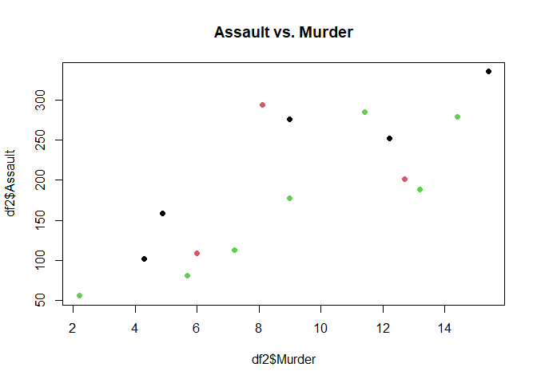

K-Means
================
Donald
2024-03-10

## R Markdown

This is an R Markdown document. Markdown is a simple formatting syntax
for authoring HTML, PDF, and MS Word documents. For more details on
using R Markdown see <http://rmarkdown.rstudio.com>.

When you click the **Knit** button a document will be generated that
includes both content as well as the output of any embedded R code
chunks within the document. You can embed an R code chunk like this:

# Initiate your dataset

``` r
data("USArrests")

usa = USArrests

head(usa, 5)
```

    ##            Murder Assault UrbanPop Rape
    ## Alabama      13.2     236       58 21.2
    ## Alaska       10.0     263       48 44.5
    ## Arizona       8.1     294       80 31.0
    ## Arkansas      8.8     190       50 19.5
    ## California    9.0     276       91 40.6

``` r
names(usa)
```

    ## [1] "Murder"   "Assault"  "UrbanPop" "Rape"

# Reproducible randomizer

``` r
set.seed(123)
randomSample = sample(1:50, 15)
randomSample
```

    ##  [1] 31 15 14  3 42 43 37 48 25 26 27  5 40 28  9

``` r
df2 = usa[randomSample,]

df2
```

    ##                Murder Assault UrbanPop Rape
    ## New Mexico       11.4     285       70 32.1
    ## Iowa              2.2      56       57 11.3
    ## Indiana           7.2     113       65 21.0
    ## Arizona           8.1     294       80 31.0
    ## Tennessee        13.2     188       59 26.9
    ## Texas            12.7     201       80 25.5
    ## Oregon            4.9     159       67 29.3
    ## West Virginia     5.7      81       39  9.3
    ## Missouri          9.0     178       70 28.2
    ## Montana           6.0     109       53 16.4
    ## Nebraska          4.3     102       62 16.5
    ## California        9.0     276       91 40.6
    ## South Carolina   14.4     279       48 22.5
    ## Nevada           12.2     252       81 46.0
    ## Florida          15.4     335       80 31.9

``` r
df2.scaled = scale(df2)

df2.scaled
```

    ##                     Murder     Assault    UrbanPop        Rape
    ## New Mexico      0.58508090  1.02300309  0.22505574  0.61101857
    ## Iowa           -1.70220419 -1.54760088 -0.68923319 -1.43885018
    ## Indiana        -0.45911447 -0.90775622 -0.12659385 -0.48290177
    ## Arizona        -0.23535832  1.12403120  0.92835492  0.50261205
    ## Tennessee       1.03259320 -0.06585536 -0.54857336  0.09855138
    ## Texas           0.90828422  0.08007413  0.92835492 -0.03942055
    ## Oregon         -1.03093574 -0.39139036  0.01406598  0.33507470
    ## West Virginia  -0.83204139 -1.26696726 -1.95517172 -1.63595295
    ## Missouri       -0.01160217 -0.17810880  0.22505574  0.22666818
    ## Montana        -0.75745600 -0.95265760 -0.97055287 -0.93623813
    ## Nebraska       -1.18010651 -1.03123501 -0.33758361 -0.92638299
    ## California     -0.01160217  0.92197499  1.70198401  1.44870532
    ## South Carolina  1.33093473  0.95565102 -1.32220246 -0.33507470
    ## Nevada          0.78397525  0.65256671  0.99868483  1.98088278
    ## Florida         1.57955267  1.58427034  0.92835492  0.59130829
    ## attr(,"scaled:center")
    ##     Murder    Assault   UrbanPop       Rape 
    ##   9.046667 193.866667  66.800000  25.900000 
    ## attr(,"scaled:scale")
    ##    Murder   Assault  UrbanPop      Rape 
    ##  4.022236 89.084123 14.218700 10.146991

# Euclidean Distance

``` r
library("factoextra")
```

    ## Warning: package 'factoextra' was built under R version 4.3.3

    ## Loading required package: ggplot2

    ## Warning: package 'ggplot2' was built under R version 4.3.3

    ## Welcome! Want to learn more? See two factoextra-related books at https://goo.gl/ve3WBa

``` r
dist.eucl1 = dist(df2.scaled, method = "euclidean")

dist.eucl1
```

    ##                New Mexico      Iowa   Indiana   Arizona Tennessee     Texas
    ## Iowa            4.1082312                                                  
    ## Indiana         2.4775986 1.7846775                                        
    ## Arizona         1.0907378 3.9591819 2.5024750                              
    ## Tennessee       1.4990012 3.4724739 1.8574561 2.3169189                    
    ## Texas           1.3824891 3.7468614 2.0384260 1.6405987 1.4956943          
    ## Oregon          2.1754724 2.3299921 1.1324681 1.9476753 2.1763803 2.2268866
    ## West Virginia   4.1297061 1.5739722 2.2229105 4.3544334 3.1474682 3.9631926
    ## Missouri        1.3951436 2.8885151 1.1661044 1.5219757 1.3106718 1.2158464
    ## Montana         3.0869279 1.2562907 1.0043926 3.2033362 2.2890064 2.8725177
    ## Nebraska        3.1647982 0.9620290 0.8810612 3.0302391 2.6311604 2.8258957
    ## California      1.8025742 4.7971697 3.2592923 1.2587645 2.9923364 2.0899781
    ## South Carolina  1.9621250 4.1334214 2.8509464 2.8719947 1.3852857 2.4693498
    ## Nevada          1.6284385 5.0562305 3.3639807 1.8578349 2.5524734 2.1047024
    ## Florida         1.3412730 5.2265362 3.5543219 1.8744570 2.3337108 1.7638102
    ##                   Oregon West Virginia  Missouri   Montana  Nebraska California
    ## Iowa                                                                           
    ## Indiana                                                                        
    ## Arizona                                                                        
    ## Tennessee                                                                      
    ## Texas                                                                          
    ## Oregon                                                                         
    ## West Virginia  2.9272924                                                       
    ## Missouri       1.0680817     3.1751350                                         
    ## Montana        1.7249703     1.2503714 1.9844533                               
    ## Nebraska       1.4651232     1.8157092 1.9337313 0.7652157                     
    ## California     2.6178636     5.3248937 2.2101756 4.1110770 3.8705700           
    ## South Carolina 3.1028481     3.4221970 2.4077748 2.9134297 3.4017884  3.7591374
    ## Nevada         2.8393497     5.3012159 2.2357853 4.1641622 4.1146826  1.2179355
    ## Florida        3.4087336     5.2173518 2.5030673 4.2233709 4.2851574  2.0746182
    ##                South Carolina    Nevada
    ## Iowa                                   
    ## Indiana                                
    ## Arizona                                
    ## Tennessee                              
    ## Texas                                  
    ## Oregon                                 
    ## West Virginia                          
    ## Missouri                               
    ## Montana                                
    ## Nebraska                               
    ## California                             
    ## South Carolina                         
    ## Nevada              3.3378439          
    ## Florida             2.5258993 1.8538820

``` r
round(dist.eucl1, 1)
```

    ##                New Mexico Iowa Indiana Arizona Tennessee Texas Oregon
    ## Iowa                  4.1                                            
    ## Indiana               2.5  1.8                                       
    ## Arizona               1.1  4.0     2.5                               
    ## Tennessee             1.5  3.5     1.9     2.3                       
    ## Texas                 1.4  3.7     2.0     1.6       1.5             
    ## Oregon                2.2  2.3     1.1     1.9       2.2   2.2       
    ## West Virginia         4.1  1.6     2.2     4.4       3.1   4.0    2.9
    ## Missouri              1.4  2.9     1.2     1.5       1.3   1.2    1.1
    ## Montana               3.1  1.3     1.0     3.2       2.3   2.9    1.7
    ## Nebraska              3.2  1.0     0.9     3.0       2.6   2.8    1.5
    ## California            1.8  4.8     3.3     1.3       3.0   2.1    2.6
    ## South Carolina        2.0  4.1     2.9     2.9       1.4   2.5    3.1
    ## Nevada                1.6  5.1     3.4     1.9       2.6   2.1    2.8
    ## Florida               1.3  5.2     3.6     1.9       2.3   1.8    3.4
    ##                West Virginia Missouri Montana Nebraska California
    ## Iowa                                                             
    ## Indiana                                                          
    ## Arizona                                                          
    ## Tennessee                                                        
    ## Texas                                                            
    ## Oregon                                                           
    ## West Virginia                                                    
    ## Missouri                 3.2                                     
    ## Montana                  1.3      2.0                            
    ## Nebraska                 1.8      1.9     0.8                    
    ## California               5.3      2.2     4.1      3.9           
    ## South Carolina           3.4      2.4     2.9      3.4        3.8
    ## Nevada                   5.3      2.2     4.2      4.1        1.2
    ## Florida                  5.2      2.5     4.2      4.3        2.1
    ##                South Carolina Nevada
    ## Iowa                                
    ## Indiana                             
    ## Arizona                             
    ## Tennessee                           
    ## Texas                               
    ## Oregon                              
    ## West Virginia                       
    ## Missouri                            
    ## Montana                             
    ## Nebraska                            
    ## California                          
    ## South Carolina                      
    ## Nevada                    3.3       
    ## Florida                   2.5    1.9

``` r
round(as.matrix(dist.eucl1)[1:3,1:3], 1)
```

    ##            New Mexico Iowa Indiana
    ## New Mexico        0.0  4.1     2.5
    ## Iowa              4.1  0.0     1.8
    ## Indiana           2.5  1.8     0.0

# K-Means Clusters

``` r
k_clusters1 = kmeans(USArrests, 3)
k_clusters1
```

    ## K-means clustering with 3 clusters of sizes 20, 14, 16
    ## 
    ## Cluster means:
    ##      Murder  Assault UrbanPop     Rape
    ## 1  4.270000  87.5500 59.75000 14.39000
    ## 2  8.214286 173.2857 70.64286 22.84286
    ## 3 11.812500 272.5625 68.31250 28.37500
    ## 
    ## Clustering vector:
    ##        Alabama         Alaska        Arizona       Arkansas     California 
    ##              3              3              3              2              3 
    ##       Colorado    Connecticut       Delaware        Florida        Georgia 
    ##              2              1              3              3              2 
    ##         Hawaii          Idaho       Illinois        Indiana           Iowa 
    ##              1              1              3              1              1 
    ##         Kansas       Kentucky      Louisiana          Maine       Maryland 
    ##              1              1              3              1              3 
    ##  Massachusetts       Michigan      Minnesota    Mississippi       Missouri 
    ##              2              3              1              3              2 
    ##        Montana       Nebraska         Nevada  New Hampshire     New Jersey 
    ##              1              1              3              1              2 
    ##     New Mexico       New York North Carolina   North Dakota           Ohio 
    ##              3              3              3              1              1 
    ##       Oklahoma         Oregon   Pennsylvania   Rhode Island South Carolina 
    ##              2              2              1              2              3 
    ##   South Dakota      Tennessee          Texas           Utah        Vermont 
    ##              1              2              2              1              1 
    ##       Virginia     Washington  West Virginia      Wisconsin        Wyoming 
    ##              2              2              1              1              2 
    ## 
    ## Within cluster sum of squares by cluster:
    ## [1] 19263.760  9136.643 19563.863
    ##  (between_SS / total_SS =  86.5 %)
    ## 
    ## Available components:
    ## 
    ## [1] "cluster"      "centers"      "totss"        "withinss"     "tot.withinss"
    ## [6] "betweenss"    "size"         "iter"         "ifault"

``` r
plot(df2$Murder, df2$Assault, col=k_clusters1$cluster, pch=19, cex=1, main = "Assault vs. Murder")
```

<!-- -->
