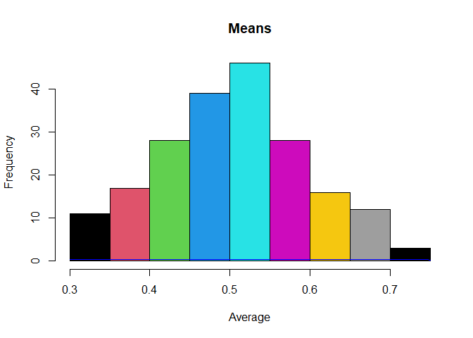

Sample_Dataset_Analysis
================
Donald
2024-03-10

## R Markdown

This is an R Markdown document. Markdown is a simple formatting syntax
for authoring HTML, PDF, and MS Word documents. For more details on
using R Markdown see <http://rmarkdown.rstudio.com>.

When you click the **Knit** button a document will be generated that
includes both content as well as the output of any embedded R code
chunks within the document. You can embed an R code chunk like this:

# Create a Sample Dataset

``` r
Sample_Set <- replicate(200, runif(n = 10))

head(Sample_Set, 3)
```

    ##           [,1]      [,2]      [,3]      [,4]       [,5]      [,6]      [,7]
    ## [1,] 0.9136710 0.7420699 0.6431419 0.1142299 0.19951579 0.3932098 0.9911199
    ## [2,] 0.2092062 0.4384168 0.2566744 0.3606380 0.30954008 0.7494560 0.1991777
    ## [3,] 0.6050728 0.2961562 0.6273421 0.4846058 0.05422443 0.9025316 0.3435758
    ##           [,8]      [,9]     [,10]     [,11]      [,12]     [,13]     [,14]
    ## [1,] 0.5050725 0.3257794 0.3788025 0.1494906 0.14361941 0.6101760 0.2088864
    ## [2,] 0.3940620 0.8982250 0.9489164 0.8686863 0.01088239 0.2609723 0.4728755
    ## [3,] 0.1199007 0.1043307 0.1928544 0.1121816 0.39934307 0.3155635 0.1294167
    ##          [,15]     [,16]     [,17]     [,18]     [,19]     [,20]      [,21]
    ## [1,] 0.5695437 0.3361776 0.1633333 0.2539295 0.3525614 0.5448840 0.94512782
    ## [2,] 0.3192167 0.6635967 0.6710602 0.8274388 0.9078345 0.6436964 0.90015470
    ## [3,] 0.8071836 0.9050264 0.9490843 0.6662085 0.8900611 0.6945235 0.08227392
    ##          [,22]     [,23]     [,24]     [,25]     [,26]        [,27]     [,28]
    ## [1,] 0.9150870 0.4859587 0.7558665 0.7465990 0.4428686 0.8745597089 0.2159919
    ## [2,] 0.6418224 0.4850095 0.6451322 0.4184108 0.2195844 0.0009352188 0.3482203
    ## [3,] 0.6141259 0.9867140 0.5419660 0.6568384 0.4602333 0.9238849515 0.3461629
    ##          [,29]     [,30]      [,31]      [,32]      [,33]     [,34]     [,35]
    ## [1,] 0.1210675 0.5227140 0.06232767 0.89627493 0.28909623 0.9886284 0.1691904
    ## [2,] 0.4503107 0.1179056 0.16363092 0.02184909 0.08452100 0.4952074 0.7338080
    ## [3,] 0.0945093 0.3488727 0.32997587 0.90060282 0.05519956 0.9989166 0.6432755
    ##          [,36]     [,37]     [,38]     [,39]     [,40]     [,41]     [,42]
    ## [1,] 0.8287086 0.9533591 0.2187205 0.3040361 0.7143884 0.8056888 0.7058535
    ## [2,] 0.5338719 0.5040205 0.4710508 0.1172676 0.5983203 0.1382642 0.3444919
    ## [3,] 0.9522300 0.5608209 0.1076797 0.1539169 0.7001957 0.4971664 0.8090970
    ##          [,43]     [,44]     [,45]     [,46]     [,47]     [,48]     [,49]
    ## [1,] 0.8474404 0.4232820 0.5777402 0.3582140 0.9561388 0.7966739 0.2178779
    ## [2,] 0.5257288 0.3488233 0.2436974 0.6448206 0.8409430 0.9842022 0.9951857
    ## [3,] 0.8835114 0.3552213 0.0484918 0.8780984 0.6283875 0.1731553 0.4980324
    ##           [,50]      [,51]     [,52]     [,53]     [,54]     [,55]      [,56]
    ## [1,] 0.05439836 0.08330857 0.9098222 0.3791567 0.7697835 0.7964026 0.02017834
    ## [2,] 0.96230960 0.27360346 0.3156936 0.5102989 0.3212678 0.6062008 0.87800236
    ## [3,] 0.14170344 0.59257158 0.5177788 0.1712048 0.8955092 0.3421291 0.90944840
    ##           [,57]     [,58]      [,59]     [,60]     [,61]     [,62]     [,63]
    ## [1,] 0.09099486 0.7229219 0.50344986 0.1714169 0.1760849 0.3528815 0.2563895
    ## [2,] 0.60289099 0.3281794 0.14471530 0.3501071 0.9018841 0.5521024 0.6027038
    ## [3,] 0.04191910 0.2214103 0.04328756 0.6206543 0.7820264 0.5584455 0.6913450
    ##          [,64]      [,65]     [,66]     [,67]     [,68]     [,69]     [,70]
    ## [1,] 0.3327964 0.01310103 0.8446657 0.1576188 0.2073489 0.2141068 0.6869298
    ## [2,] 0.4898218 0.03620784 0.3435784 0.8613376 0.7181010 0.3310273 0.9027054
    ## [3,] 0.3869372 0.46912935 0.1355652 0.7395389 0.1965230 0.4775385 0.4625582
    ##          [,71]     [,72]      [,73]      [,74]     [,75]      [,76]       [,77]
    ## [1,] 0.7296617 0.6998897 0.92530855 0.75235572 0.4637191 0.20362339 0.496787607
    ## [2,] 0.8202988 0.9905899 0.18798800 0.07620323 0.7939710 0.04913052 0.008322349
    ## [3,] 0.6907809 0.8302133 0.07887635 0.56497262 0.7506882 0.07538692 0.934453925
    ##          [,78]       [,79]     [,80]     [,81]     [,82]     [,83]     [,84]
    ## [1,] 0.1047820 0.002422957 0.3782667 0.3700058 0.3826443 0.4185770 0.1487448
    ## [2,] 0.8997732 0.506546652 0.1909179 0.4887524 0.1603893 0.3623917 0.8955309
    ## [3,] 0.9723007 0.794502550 0.1752705 0.8591804 0.8917007 0.8653293 0.1566284
    ##          [,85]     [,86]     [,87]     [,88]     [,89]     [,90]      [,91]
    ## [1,] 0.5456038 0.2467634 0.4182085 0.7575016 0.7642462 0.8882111 0.01718412
    ## [2,] 0.2687091 0.3437512 0.8009127 0.3028229 0.6892365 0.9090850 0.93511802
    ## [3,] 0.5379640 0.4133429 0.6836446 0.8978556 0.7363229 0.6119617 0.65825716
    ##          [,92]     [,93]     [,94]     [,95]      [,96]      [,97]     [,98]
    ## [1,] 0.9787942 0.8004852 0.8346690 0.7236802 0.02442129 0.09694617 0.4103164
    ## [2,] 0.9898736 0.2178049 0.5395714 0.1999690 0.23413023 0.90872849 0.8719062
    ## [3,] 0.7953734 0.5720647 0.8392027 0.5873764 0.61501602 0.55685384 0.8463489
    ##          [,99]     [,100]    [,101]    [,102]    [,103]    [,104]    [,105]
    ## [1,] 0.9443324 0.86701511 0.3466623 0.4567008 0.8639371 0.2014461 0.9183496
    ## [2,] 0.5832210 0.59315244 0.6330789 0.6644246 0.6297949 0.2190010 0.4543005
    ## [3,] 0.4546783 0.07942002 0.8676932 0.6686091 0.6265940 0.6151450 0.3348077
    ##           [,106]     [,107]     [,108]    [,109]    [,110]     [,111]    [,112]
    ## [1,] 0.009265221 0.30720534 0.08607512 0.4560880 0.2941358 0.99524989 0.1912790
    ## [2,] 0.150010324 0.09425547 0.54170014 0.6291975 0.8976188 0.18235374 0.3504285
    ## [3,] 0.774562643 0.40781281 0.23315008 0.4795986 0.8358316 0.03123001 0.2540892
    ##         [,113]    [,114]    [,115]     [,116]    [,117]    [,118]     [,119]
    ## [1,] 0.8213925 0.5790670 0.7163440 0.06632853 0.2032370 0.4920015 0.03930111
    ## [2,] 0.2224609 0.8036490 0.2817081 0.34524770 0.5087194 0.2518289 0.11844908
    ## [3,] 0.1980916 0.4906513 0.6649221 0.45480474 0.3504490 0.7400201 0.82751373
    ##         [,120]    [,121]    [,122]    [,123]     [,124]    [,125]    [,126]
    ## [1,] 0.4018017 0.8545952 0.5124898 0.7332672 0.07525082 0.3511814 0.3854474
    ## [2,] 0.3876952 0.7451546 0.3773113 0.5955174 0.89301392 0.4491391 0.4396263
    ## [3,] 0.8412555 0.7183829 0.7467028 0.1681230 0.16925993 0.1114487 0.6203094
    ##         [,127]    [,128]      [,129]    [,130]    [,131]    [,132]    [,133]
    ## [1,] 0.5758332 0.5941657 0.809758987 0.4675927 0.3312020 0.8269742 0.1271219
    ## [2,] 0.7178025 0.2650626 0.008741612 0.5526581 0.5293873 0.9920969 0.5852128
    ## [3,] 0.8408980 0.5228392 0.098087725 0.5483715 0.8040366 0.1270682 0.9522489
    ##         [,134]     [,135]      [,136]    [,137]    [,138]    [,139]    [,140]
    ## [1,] 0.5602220 0.18588537 0.761503103 0.7946025 0.4600865 0.8296986 0.6455704
    ## [2,] 0.9705891 0.64273203 0.007920288 0.7073433 0.9152750 0.4012943 0.3287884
    ## [3,] 0.1938864 0.09715463 0.186642649 0.5522749 0.4382452 0.4353019 0.4934416
    ##          [,141]    [,142]    [,143]     [,144]    [,145]     [,146]    [,147]
    ## [1,] 0.76161773 0.2864074 0.4838032 0.08514401 0.5312147 0.46980585 0.2090347
    ## [2,] 0.98527097 0.1601674 0.9963682 0.95790911 0.9292341 0.04899368 0.3983586
    ## [3,] 0.06031645 0.6812909 0.1031535 0.84900569 0.0165957 0.10007651 0.7704298
    ##         [,148]    [,149]    [,150]    [,151]    [,152]    [,153]     [,154]
    ## [1,] 0.2748877 0.2181567 0.7128740 0.6157273 0.5473193 0.7085927 0.06811486
    ## [2,] 0.6123151 0.6596357 0.3043794 0.6618782 0.4340752 0.5741913 0.05491314
    ## [3,] 0.8837872 0.2710578 0.5550889 0.4365323 0.8996473 0.0993722 0.40710016
    ##         [,155]    [,156]     [,157]    [,158]      [,159]    [,160]    [,161]
    ## [1,] 0.8013209 0.9607804 0.79296867 0.5028284 0.890666456 0.4188921 0.5482897
    ## [2,] 0.7567507 0.4837347 0.98627582 0.8506898 0.006250269 0.5862520 0.9758859
    ## [3,] 0.8319253 0.5870448 0.03123994 0.6589454 0.301541413 0.7006985 0.2407091
    ##         [,162]    [,163]    [,164]    [,165]    [,166]    [,167]    [,168]
    ## [1,] 0.1296906 0.3153763 0.1220742 0.9475336 0.2853906 0.5820762 0.1435337
    ## [2,] 0.9781901 0.2133428 0.2621120 0.4389028 0.1144414 0.9229044 0.5719697
    ## [3,] 0.1504823 0.3036840 0.5629043 0.4685954 0.2846716 0.2909469 0.6276336
    ##         [,169]    [,170]     [,171]    [,172]    [,173]    [,174]    [,175]
    ## [1,] 0.8930345 0.5291807 0.10326631 0.7570230 0.2931409 0.5524432 0.2301266
    ## [2,] 0.6019361 0.5401750 0.03461724 0.9060431 0.9454103 0.2439455 0.3538911
    ## [3,] 0.6708201 0.5820174 0.77462342 0.7688798 0.1046232 0.6830474 0.6104829
    ##           [,176]    [,177]    [,178]    [,179]     [,180]      [,181]    [,182]
    ## [1,] 0.658051367 0.6657105 0.6227793 0.4159508 0.01160437 0.081495314 0.4424787
    ## [2,] 0.883460621 0.6488017 0.7969558 0.5922356 0.89809785 0.006280826 0.8403912
    ## [3,] 0.006186449 0.6315686 0.7629278 0.1472675 0.71401481 0.325675004 0.3320150
    ##          [,183]     [,184]    [,185]    [,186]    [,187]     [,188]    [,189]
    ## [1,] 0.71063444 0.51146865 0.3344964 0.8628012 0.6940713 0.63437727 0.8296518
    ## [2,] 0.05213117 0.62804142 0.7917143 0.7923608 0.2385867 0.45926488 0.6884221
    ## [3,] 0.95679858 0.01419545 0.8808307 0.3469536 0.7614626 0.02474811 0.9497965
    ##          [,190]     [,191]    [,192]    [,193]    [,194]    [,195]     [,196]
    ## [1,] 0.01827570 0.30466646 0.3121956 0.6027821 0.1914818 0.6161468 0.39332149
    ## [2,] 0.05801845 0.91500882 0.7615148 0.4008021 0.9918691 0.2249182 0.75307235
    ## [3,] 0.78827307 0.05712836 0.8553297 0.2119218 0.5878741 0.4094030 0.08170423
    ##         [,197]     [,198]     [,199]    [,200]
    ## [1,] 0.8274227 0.05475188 0.51639164 0.6516152
    ## [2,] 0.8609556 0.43679152 0.29069246 0.5836603
    ## [3,] 0.8584876 0.67158561 0.08958667 0.7935804

# Sample Mean

``` r
sample_means <- colMeans(Sample_Set)

head(sample_means, 20)
```

    ##  [1] 0.6037882 0.5007054 0.3941040 0.3306791 0.4899929 0.5551359 0.4291911
    ##  [8] 0.5033266 0.6733072 0.6943471 0.5368356 0.3071890 0.4785274 0.4212171
    ## [15] 0.6174189 0.4476633 0.5602164 0.5189329 0.6066096 0.6839523

# Histogram with the means

``` r
hist(sample_means, freq = T, main = "Means", col = palette(), xlab = "Average")
curve(dnorm(x), add = T, col="blue")
```

<!-- -->
